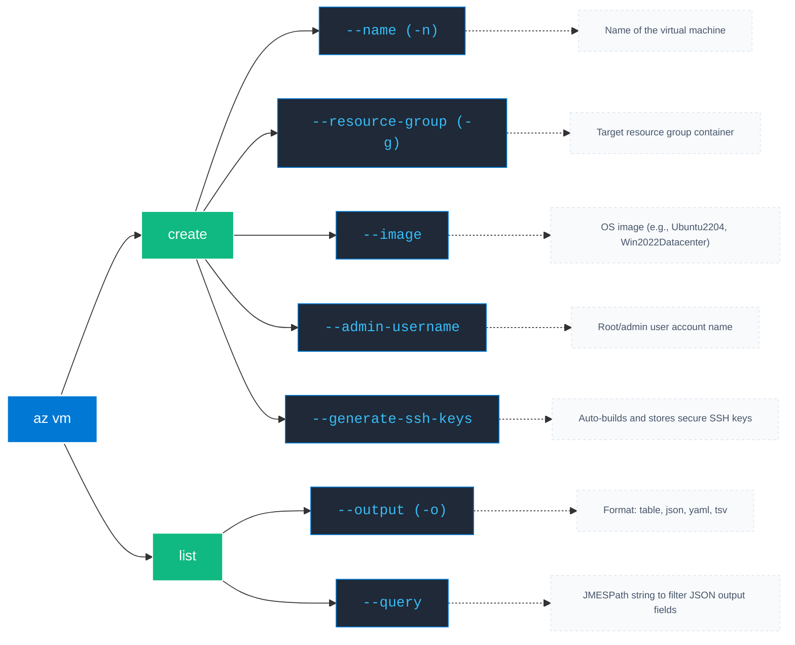

# AI-200
Coding Exercises found within the Microsoft Learn path of the AI-200 exam

## Exercises
1. Build and run a container image with ACR Tasks

## Az breakdown

```mermaid
graph LR
    %% Visual Theme Styles
    classDef service fill:#0078d4,stroke:#fff,stroke-width:2px,color:#fff;
    classDef action fill:#10b981,stroke:#fff,stroke-width:1px,color:#fff;
    classDef flag fill:#1f2937,stroke:#0078d4,stroke-width:1px,color:#38bdf8,font-family:monospace;
    classDef desc fill:#f8fafc,stroke:#e2e8f0,stroke-dasharray: 3 3,color:#475569,font-size:11px;

    %% SERVICE LEVEL
    VM[az vm]:::service

    %% ACTION LEVEL
    VM --> Create[create]:::action
    VM --> List[list]:::action

    %% FLAGS FOR 'CREATE'
    Create --> f_name["--name (-n)"]:::flag
    f_name -.-> d_name["Name of the virtual machine"]:::desc

    Create --> f_rg["--resource-group (-g)"]:::flag
    f_rg -.-> d_rg["Target resource group container"]:::desc

    Create --> f_img["--image"]:::flag
    f_img -.-> d_img["OS image (e.g., Ubuntu2204, Win2022Datacenter)"]:::desc

    Create --> f_admin["--admin-username"]:::flag
    f_admin -.-> d_admin["Root/admin user account name"]:::desc

    Create --> f_ssh["--generate-ssh-keys"]:::flag
    f_ssh -.-> d_ssh["Auto-builds and stores secure SSH keys"]:::desc

    %% FLAGS FOR 'LIST'
    List --> f_out["--output (-o)"]:::flag
    f_out -.-> d_out["Format: table, json, yaml, tsv"]:::desc

    List --> f_query["--query"]:::flag
    f_query -.-> d_query["JMESPath string to filter JSON output fields"]:::desc
```

